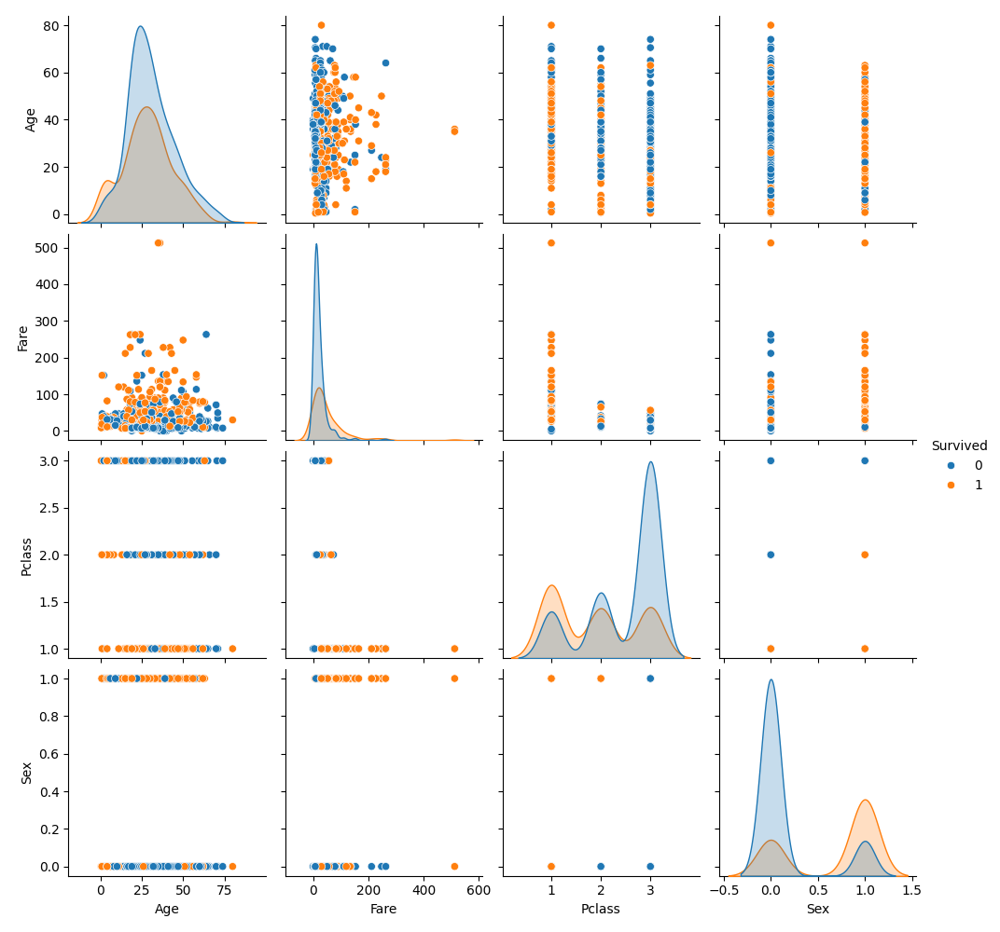

# Task 2: Exploratory Data Analysis (EDA) – Titanic Dataset

## 🎯 Objective
Perform EDA on the Titanic dataset to uncover patterns, detect anomalies, understand feature relationships, and generate meaningful visualizations.

---

## 📁 Files Included
- `EDA.py` – Python script for all EDA steps
- `Titanic-Dataset.csv` – Titanic dataset (from Kaggle)
- `Plots` – Many different plots saved as png
- `README.md` – This file

---

## 🛠️ Tools & Libraries Used
- Python
- Pandas
- NumPy
- Seaborn
- Matplotlib
- Plotly

---

## 🔍 EDA Steps Performed
1. **Summary statistics** for all numerical columns: mean, median, std, etc.
2. **Histograms** and **boxplots** for numeric features (`Age`, `Fare`, etc.)
3. **Pairplot** and **correlation matrix** to understand relationships.
4. Detected **skewness** and outliers in `Age`, `Fare`.
5. Found **trends** between `Survived` and other features like `Pclass`, `Sex`, etc.
6. Highlighted **important patterns** using visualizations.

---

## 📊 Visualizations Created
- Histogram of `Age`, `Fare`
- Boxplot of `Age` vs `Survived`
- Correlation heatmap
- Pairplot of key features
- Countplot for categorical features like `Pclass`, `Embarked`

## 🔍 Pairplot of Key Features



---

## ▶️ How to Run
Ensure you have `Titanic-Dataset.csv` in the folder, then run:
```bash
python EDA.py