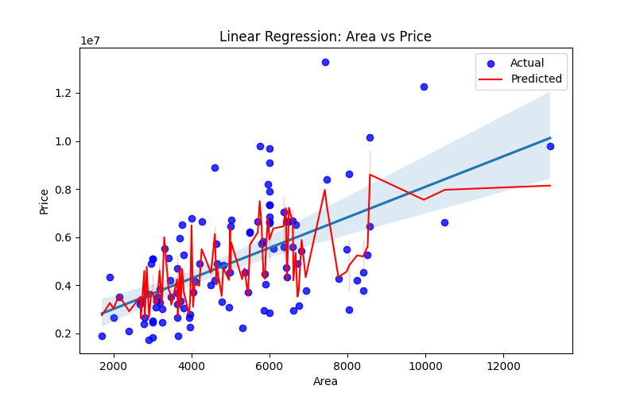

# Task 3: Linear Regression – House Price Prediction

## 🎯 Objective
Implement and understand both **simple** and **multiple linear regression** models on a dataset, evaluate them using standard metrics, and visualize the regression line.

---

## 📁 Files Included
- `linear_regression.py` – Main code file
- `Housing.csv` – Dataset (from Kaggle)
- Plot images (`regression_plot.png`, etc.)
- `README.md` – This documentation

---

## 🛠️ Libraries Used
- pandas
- numpy
- matplotlib
- seaborn
- scikit-learn

---

## 🔢 Steps Performed

1. **Imported and cleaned** the dataset
2. Split data into **train and test sets**
3. Fitted **LinearRegression** using `sklearn.linear_model`
4. Evaluated using:
   - MAE (Mean Absolute Error)
   - MSE (Mean Squared Error)
   - R² Score
5. Plotted regression line (for simple regression)
6. Interpreted coefficients and model performance

---

## 🖼️ Visualization

### 📉 Regression Line


---

## ▶️ How to Run

Make sure `Housing.csv` is in the same folder. Then run:

```bash
pip install pandas numpy matplotlib seaborn scikit-learn
python linear_regression.py