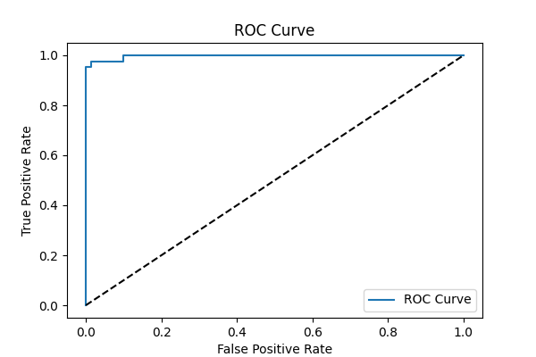
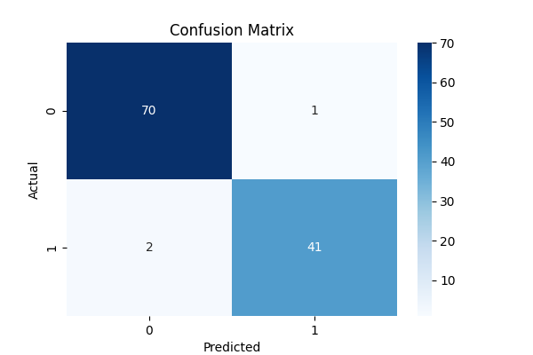

# Task 4: Binary Classification using Logistic Regression

## 🎯 Objective
Train a logistic regression model on a binary classification dataset, evaluate its performance using metrics like accuracy, confusion matrix, ROC-AUC, and explain the sigmoid and threshold.

---

## 📁 Files Included
- `logistic_regression.py` – Main code file
- `breast_cancer.csv` – Dataset (or use `sklearn.datasets.load_breast_cancer`)
- Plot files:
  - `confusion_matrix.png`
  - `roc_curve.png`
  - `sigmoid_curve.png`
- `README.md` – This documentation

---

## 🧰 Libraries Used
- pandas
- numpy
- matplotlib
- seaborn
- scikit-learn

---

## 📊 Classification Metrics Used
- **Confusion Matrix**
- **Accuracy**
- **Precision**
- **Recall**
- **F1 Score**
- **ROC-AUC**

---

## 🖼️ Visuals

### 🔹 ROC Curve


### 🔹 Confusion Matrix


---

## ▶️ How to Run

```bash
pip install pandas numpy matplotlib seaborn scikit-learn
python logistic_regression.py