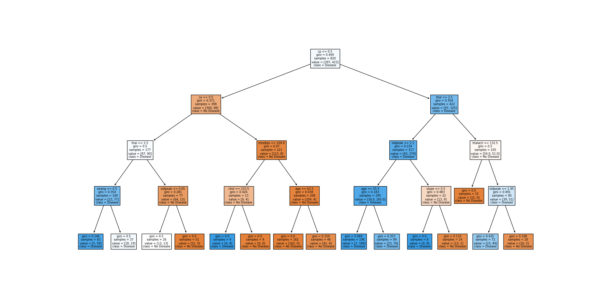
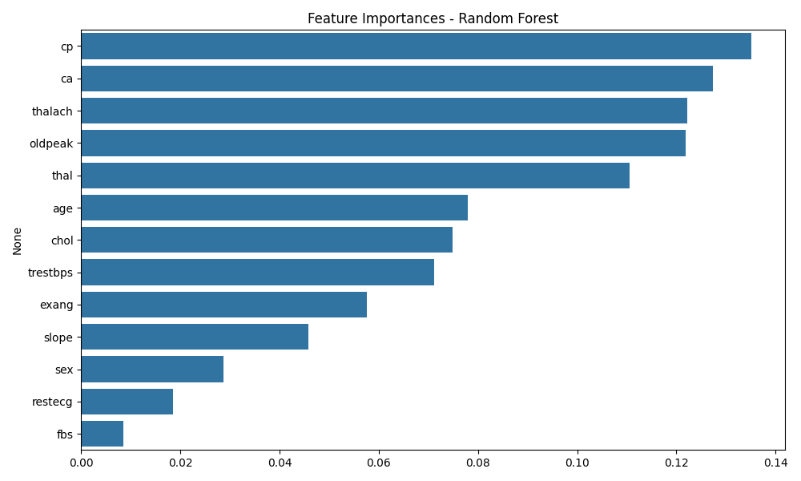

# Task 5: Decision Trees and Random Forests – Heart Disease Prediction

## 🎯 Objective
Train and evaluate Decision Tree and Random Forest classifiers on a medical dataset. Understand overfitting, visualize trees, compare model performance, and interpret feature importance.

---

## 📁 Files Included
- `tree_models.py` – Main code for Decision Tree and Random Forest
- `heart.csv` – Dataset from Kaggle
- `decision_tree.png` – Visualized tree
- `feature_importance.png` - Importance of various features
- `README.md` – Documentation

---

## 🛠️ Libraries Used
- pandas
- numpy
- matplotlib
- seaborn
- scikit-learn
- graphviz / matplotlib (for tree visualization)

---

## 🔁 Steps Performed
1. Loaded and preprocessed the dataset.
2. Trained a **Decision Tree Classifier**.
3. Visualized the tree using `plot_tree`.
4. Analyzed **overfitting** and controlled using `max_depth`.
5. Trained a **Random Forest Classifier**.
6. Compared accuracy, F1 score, and confusion matrix.
7. Interpreted **feature importance**.
8. Used **cross-validation** for robust evaluation.

---

## 🖼️ Visuals

### 🔹 ROC Curve

### 🔹 Confusion Matrix
