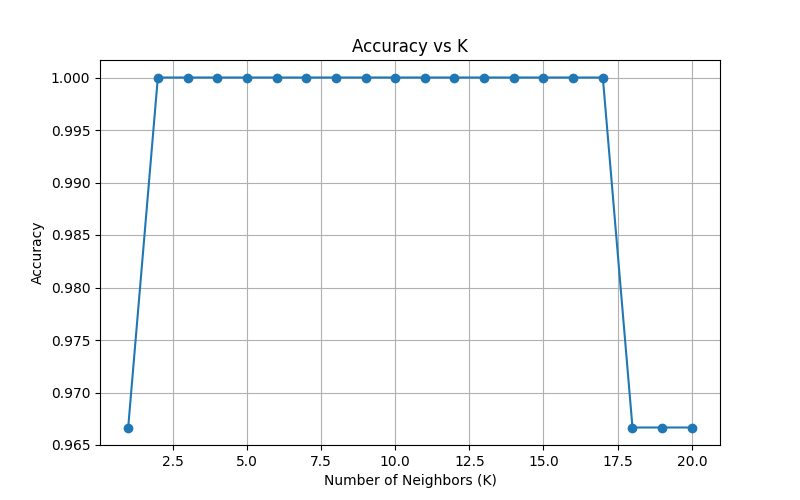

# Task 6: K-Nearest Neighbors (KNN) Classification – Iris Dataset

## 🎯 Objective
Implement and evaluate the K-Nearest Neighbors (KNN) algorithm on a classification dataset. Experiment with different K values, evaluate accuracy, and visualize decision boundaries.

---

## 📁 Files Included
- `knn_classifier.py` – Main KNN code
- `iris.csv` – Dataset from Kaggle or scikit-learn
- `knn_accuracy_plot.png` – Accuracy vs K plot
- `README.md` – This documentation

---

## 🛠️ Libraries Used
- pandas
- numpy
- matplotlib
- seaborn
- scikit-learn

---

## 🔁 Steps Performed
1. Loaded the Iris dataset.
2. Normalized features using `StandardScaler`.
3. Split data into train/test sets.
4. Trained **KNeighborsClassifier** with multiple values of **K**.
5. Evaluated performance using **accuracy** and **confusion matrix**.
6. Visualized **accuracy vs K** and decision boundary.

---

## 🖼️ Visuals

### 🔹 KNN Accuracy Plot
