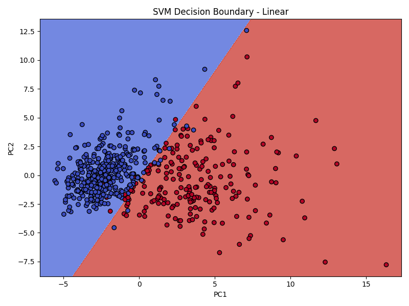
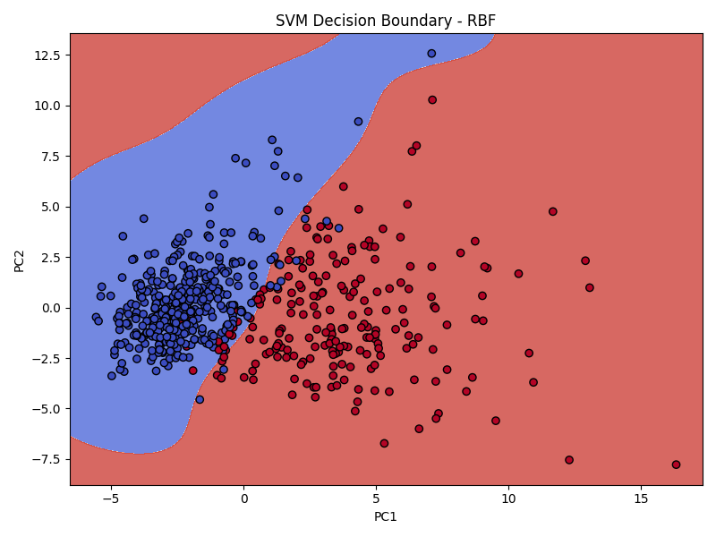

# Task 7: Support Vector Machines (SVM) – Breast Cancer Dataset

## 🎯 Objective
Use Support Vector Machines (SVM) with linear and RBF kernels to classify binary data, visualize decision boundaries, and tune hyperparameters (`C`, `gamma`).

---

## 📁 Files Included
- `svm_classifier.py` – Main code for SVM
- `data.csv` – Breast cancer dataset (from Kaggle)
- `svm_decision_boundary_linear.png`
- `svm_decision_boundary_rbf.png`
- `README.md` – This documentation

---

## 🛠️ Libraries Used
- pandas
- numpy
- matplotlib
- seaborn
- scikit-learn

---

## 🔁 Steps Performed
1. Loaded and cleaned the breast cancer dataset.
2. Scaled features using `StandardScaler`.
3. Trained:
   - Linear SVM (`kernel='linear'`)
   - RBF SVM (`kernel='rbf'`)
4. Evaluated using accuracy, classification report, confusion matrix.
5. Tuned `C` and `gamma`.
6. Visualized decision boundaries using 2D PCA-reduced features.

---

## 📊 Output Visuals

### 🔹 SVM decision boundary linear

### 🔹 SVM decision boundary rbf
