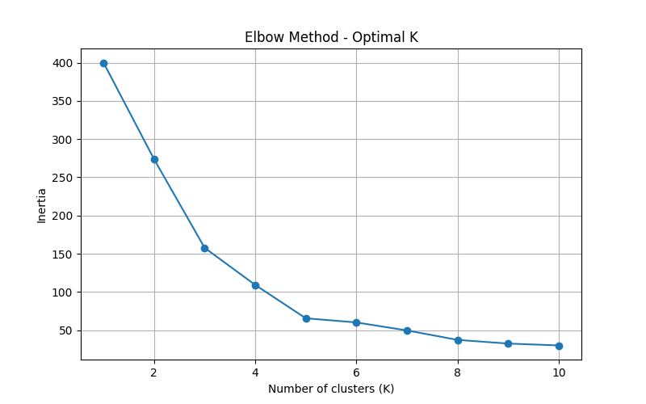
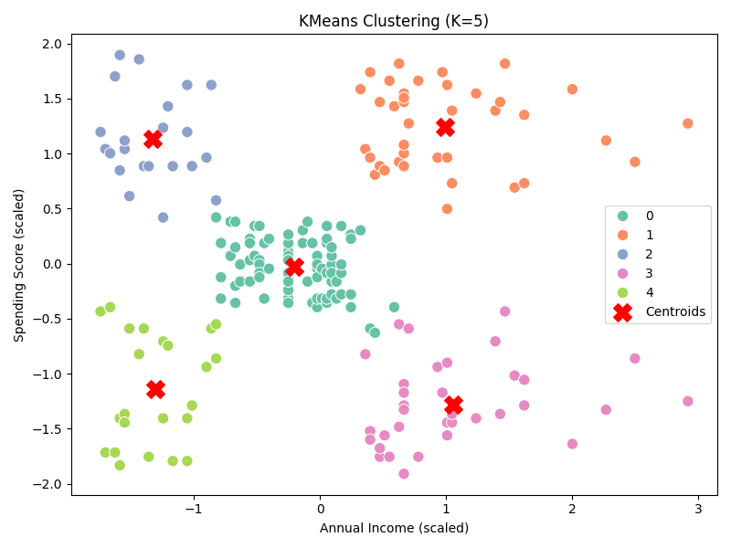

# Task 8: Clustering with K-Means – Mall Customer Dataset

## 🎯 Objective
Apply K-Means clustering to a dataset to discover customer segments. Use the Elbow Method to find optimal K, evaluate using Silhouette Score, and visualize the clusters.

---

## 📁 Files Included
- `kmeans_clustering.py` – Main clustering script
- `Mall_Customers.csv` – Dataset
- `elbow_method.png` – Plot for choosing K
- `cluster_plot.png` – Final cluster visualization
- `README.md` – This file

---

## 🛠️ Tools Used
- pandas
- numpy
- matplotlib
- seaborn
- scikit-learn

---

## 🔁 Steps Performed
1. Loaded and cleaned the dataset.
2. Scaled relevant features using `StandardScaler`.
3. Used **Elbow Method** to select optimal K.
4. Applied **KMeans clustering**.
5. Visualized clusters and centroids.
6. Evaluated clustering using **Silhouette Score**.

---

## 📊 Visual Outputs

### 🔹 Elbow Method Plot

### 🔹 Cluster Visualization
